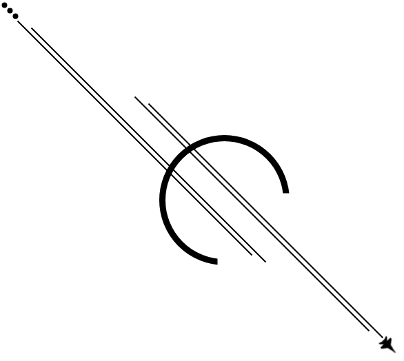

# Flight Zone


[](https://scrutinizer-ci.com/g/lotharthesavior/slim-swoole-skeleton/?branch=master)
[](https://scrutinizer-ci.com/code-intelligence)





This application is a Starting point for advanced and easy to maintain apps. Based on Slim3 and Swoole, it serves at this point HTTP and Socket servers. It is extensible via plugins that can change basically every single aspect of this application, and can also work together to build more complex things. It can also route WebSocket Messages just like HTTP Requests, for this [Socket Conveyor](https://github.com/WordsTree/socket-conveyor) is used.

The frontend is built using AlpineJS and uses JS Events to update components based on messages received by the socket server.


## Details


The data can be kept in filesystem, or via database drivers such as MySQL or MongoDB.


### Installation


The base version uses filesystem to persist data. For that to work right out of the box with the existent example model you just need to create the directory at the root of the project: `./data/`.


### Server


This app serves HTTP and WebSocket connections.

Routes are specified at the file `./src/routes.php`. The specific resources routes are intended to be kept at `./src/App/Http/todo_resource_routes.php`.

The server listens to 2 ports, one for HTTP connections, another for WebSocket connections. This can be configured at the `.env` file or at the CLI interface used to start the app shown at "[To Start Server](#To Start Server)".


#### Validation

> TODO: fix this - this suggestion will happen via plugin hook, not by the core anymore.
The request validations are done via **Middlewares**. These Middlewares can be found at `./src/App/Http/Middlewares`.


#### To Start Server


##### Bare Metal

**Basic:**

```shell
php index.php --websocket
```

**With WebSocket:**

```shell
php index.php --websocket
```

**With Custom Ports:**

For HTTP:
```shell
php index.php --port=8003
```

For Websockets:
```shell
php index.php --websocket --wsport=8004
```


##### Docker

```shell
docker-compose up -d
```


At the `docker-compose.yml` we use the strategy of static IPs. The advantage of it is that your containers don't compete with other containers in the same machine for ports. For that, "expose" parameter is used instead of "ports", and at the networks, "ipam". Commenting those out might get you to the more common configuration binding the host port to the containers.


### Plugins


Every customization happens via plugin structure. The plugin must be present at `./content/plugins` directory. Plugins must be a directory with an `index.php` file inside to be loaded.

The plugins must implements the abstraction `App\Interfaces\FlightZonePluginInterface`.


### Hooks


This application has hooks like WordPress. To understand how they work, check the project used for this: [PHP Hooks](https://github.com/voku/php-hooks).


#### Filters

**routes**

Important for Routes specification via plugins.

Location: `./src/routes.php`.

**socket_actions**

Important for Socket Actions specifications via plugins.

Location: `./src/dependencies.php`.


#### Actions

(none)


### AOP


At the plugin you'll also find the structure to extend the application via Aspects. To understand more how it works, you can read more about it [here](https://en.wikipedia.org/wiki/Aspect-oriented_programming). The PHP library used is [Ray.Aop](https://github.com/ray-di/Ray.Aop). At this application, you'll need to run the instances via Application Container to be able to intercept instances and methods.

#### Registering instances with Interceptors

The Container's method to register an interceptable instance is `withMethodInterceptor`. Here is this method's source code:

```php
...
    public function withMethodInterceptor(
        string $key,
        string $class,
        array $args,
        string $method,
        MethodInterceptor $methodInterceptor
    ): void {
        ...
        parent::offsetSet($key, $this->factory(function() use ($key, $class, $args, $method, $methodInterceptor) {
            $bind = (new Bind)->bindInterceptors($method, [$methodInterceptor]);
            $compiler = new Weaver($bind, $this->tmpDir);
            return $compiler->newInstance($class, $args, $bind);
        }));
    }
...
```

Notice from this that we use Pimple's Container method "factory", that creates an instance every time you call for it. The reason for that is that we intend to serve the application via Swoole. If you want to understand further about the mechanics behind the sequence of procedure used to bind interceptos, reference to the links at the beginning of this section.

#### Registering with Interceptors and with Parameters

Sometimes you might want to register an instance with interceptors and parameters. If so, you'll be able to do so by using the method `withMethodInterceptorWithParams`. That in reality only registers information needed by the Container to build that intance. When that instance is needed, you'll invoke that with the method `makeWithParams`. That does exactly what `withMethodInterceptor`, but with custom parameters at each creation moment.
